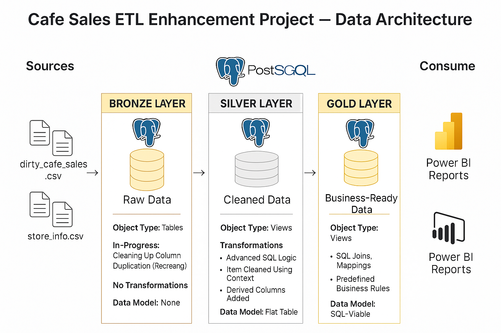

<!-- Banner Image -->
<p align="center">
  
</p>

# ☕ Cafe Sales ETL Pipeline

A modular ETL project designed to clean and transform a messy café transaction dataset using **pure SQL**, **Airflow**, and **Power BI** for analytics.  
This end-to-end pipeline simulates real-world dirty data cleanup, automation, and dashboarding — all with **minimal Python** and **maximum SQL logic**.

---

## 🚀 Overview

This project started as a CSV cleanup exercise and evolved into a structured, production-style ETL pipeline:

- Ingests messy sales data from `dirty_cafe_sales.csv`
- Performs deep cleaning using **PostgreSQL CTEs**
- Automates transformations via **Apache Airflow**
- Visualizes results through **Power BI dashboards**

Whether you're learning data engineering, building a portfolio, or testing out orchestration tools — this project is designed to showcase core concepts clearly.

---

## 🧰 Tech Stack

| Layer              | Tools Used                         |
|--------------------|------------------------------------|
| Orchestration      | Apache Airflow (LocalExecutor)     |
| Data Cleaning      | PostgreSQL (via SQL scripts)       |
| Python Integration | psycopg2, Docker                   |
| Dashboarding       | Power BI                           |
| Scheduling         | Windows Task Scheduler (Archived)  |
| Version Control    | Git, GitHub                        |

---

## 📂 Project Structure

```plaintext
ETL_PROJECT/
│
├── cafe-sales-etl/
│   ├── airflow/            → Apache Airflow DAGs, docker-compose, configs
│   ├── docker/             → Dockerfile to containerize pipeline
│   ├── raw data/           → Input CSV files (dirty_cafe_sales.csv)
│   ├── scheduling/         → Batch files for legacy scheduling (archived)
│   ├── scripts/            → Main orchestrator `run_sql_etl.py`, archived `etl_cafe_sales.py`
│   ├── sql_etl/            → Core SQL cleaning scripts
│   └── power_bi/           → Dashboards and reports
│
├── SQL_Enhancement/        → Extended SQL logic (joins, inference)
│   ├── README.md           → Explanation of logic and rules
│   └── data_architecture_cafe_sales.png → Architecture diagram
│
├── logs/                   → Logs from scheduled jobs
├── .gitignore              → Excludes compiled files, logs, etc.
└── requirements.txt        → Python dependencies
---

## ⚙️ How It Works

### 1. Raw Import
- Dirty sales data is loaded into a PostgreSQL raw_cafe_sales table using Python (run_sql_etl.py).

### 2. SQL Cleaning
- SQL scripts use CTEs to infer missing values like item, quantity, price, location, and payment_method.

### 3. Staging Table
- Cleaned and inferred data is written to staging_cafe_sales.

### 4. Automation
- The entire pipeline is containerized using Docker and scheduled via Apache Airflow DAG.

### 5. Analysis
- Cleaned data is used in Power BI for interactive reporting.

---

## 📝 Notable Enhancements

- ✅ Inference rules (e.g., guessing item from price and location)
- ✅ Context-aware NULL handling
- ✅ Robust SQL type casting and error filtering
- ✅ Automated DAG with logs
- ✅ Validated transformation using test transaction TXN_9999999

---
## 📁 Key Files

|File/Folder |	Description |
|------------|--------------|
|scripts/run_sql_etl.py	|✅ Main orchestrator using psycopg2|
|scripts/etl_cafe_sales.py|	🗃️ Archived version from initial setup|
|sql_etl/*.sql |	Raw and staging SQL logic|
|power_bi/dashboard.pbix|	Final report visualizing cleaned data|
|airflow/docker-compose.yml|	Airflow orchestration setup|
|scheduling/run_etl.bat	| Archived manual trigger method (Windows)|

---

## 🔗 Linked Sections
- 📊 SQL Enhancement Folder
- 📈 Power BI Visuals
- 🗃️ Archived Python Script

---

Modular ETL pipeline project using SQL, Airflow, and Power BI with real-world dirty data.
## 🧠 What I Learned
- Writing production-style SQL with CTEs
- Orchestrating data pipelines via Airflow
- Debugging Docker and Airflow containers
- Building traceable and testable ETL flows
- Structuring a portfolio-ready GitHub project

---

## ✅ Changelog
- Week 1–2: CSV import, raw table, and cleaning logic
- Week 3–4: Inference logic via SQL + staging table
- Week 5: Power BI integration
- Week 6–7: Docker + Task Scheduler (archived)
- Week 8–9: Airflow integration
- Week 10–Final: Cleanup, testing, and README polish

---
## 🙋‍♀️ About Me

👩‍💻 **Aakash Pal**  
🌍 Hyderabad, India  
🎯 Aspiring Cloud ETL Engineer  
🔗 GitHub: [Aakash Pal](https://github.com/Aakash-pal)
- This project was built to gain hands-on experience in real-world data engineering practices — focusing on raw data challenges, SQL mastery, and visual storytelling.

---

## 📬 Contact

If you're hiring, collaborating, or want to give feedback — feel free to reach out via LinkedIn or raise an issue in this repo.