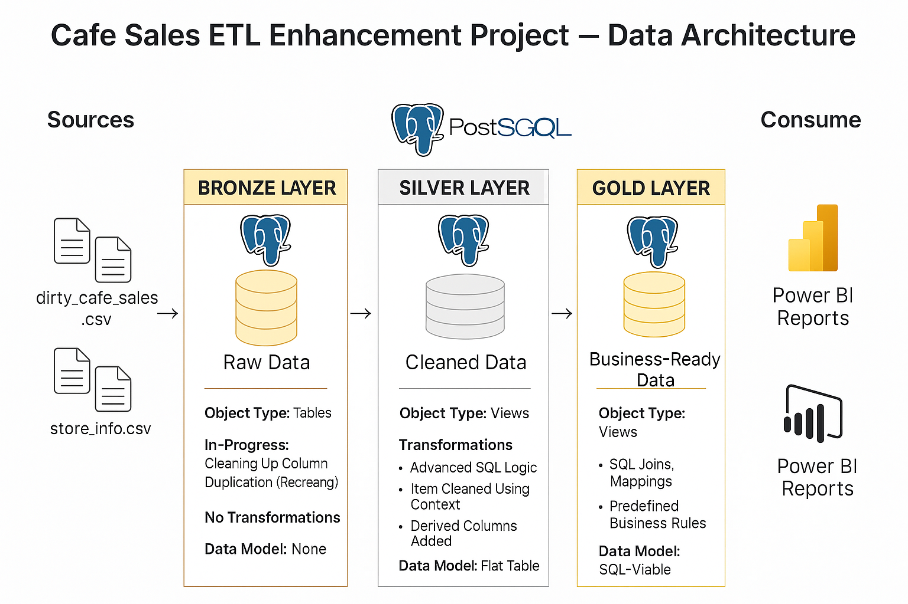

# ☕ SQL Enhancement – Intelligent Data Cleaning & Transformation

> **Part of the Modular Café Sales ETL Project** – This module focuses exclusively on deep cleaning and intelligent data inference using **pure SQL** with PostgreSQL CTEs.

---

## 📌 Overview
The **SQL Enhancement** module demonstrates advanced SQL transformation logic applied to real-world, messy café sales data.  
Instead of simply nullifying dirty values, this stage infers missing or incorrect fields using contextual rules — for example, deducing missing `item` names from `price_per_unit` and `location`.

This work forms the **core business logic** of the pipeline before analysis and visualization.

---

## 🚀 Features
- Cleans and standardizes raw transactional data.
- Uses **multi-step CTE chains** for logical transformations.
- Infers:
  - **Quantity** when `price_per_unit` and `total_spent` are known.
  - **Price per unit** when `quantity` and `total_spent` are known.
  - **Item name** using `cleaned_price` and `location` mapping rules.
  - **Location** and **payment method** from inferred product details.
- Ensures data types and formats are correct for analysis.

---

## 🛠️ Tech Stack

| Tool / Technology | Purpose |
|-------------------|---------|
| **PostgreSQL** | Data storage and SQL transformations |
| **CTEs (Common Table Expressions)** | Step-by-step cleaning and inference |
| **Docker** | Containerized PostgreSQL environment |
| **Airflow** | Current standard for orchestration (Python-based trigger for SQL scripts) |
| **Python (Archived Script)** | Original orchestration method before Airflow |

---

## 📂 Folder Structure
SQL_Enhancement/
│
├── README.md → This file
├── data_architecture_cafe_sales.png → Visual overview of the SQL cleaning flow
├── power_bi/ → Power BI dashboard using cleaned dataset
└── *.sql → SQL scripts for table creation, cleaning, and validation

---

## 🔄 Workflow
1. **Raw Table Creation** – Imports data exactly as it appears in CSV.
2. **Staging Table Creation** – Applies cleaning and inference logic using chained CTEs.
3. **Validation Queries** – Ensures cleaned dataset meets quality standards.
4. **Downstream Use** – Staging table becomes the input for Power BI dashboards.

---

📆 Project Timeline & Tasks
Week	Task	Status
|------|-------------------------------------------------------------- |---------|
|Week 1|	Create raw_cafe_sales table & import dirty_cafe_sales.csv  |	✅ Completed|
|Week 2|	Introduce staging table with contextual repair logic       |	✅ Completed|
|Week 3|	Implement advanced CTE cleaning logic for item, location, and payment_method|	✅ Completed|
|Week 4|	Validate transformations via SQL queries                   |	✅ Completed|
|Week 5|	Document enhancements & prepare for integration with Airflow|	✅ Completed|

---

## 📜 Changelog
| Date       | Change |
|------------|--------|
| 2025-07-08 | Initial creation of SQL-only ETL project |
| 2025-07-10 | Added intelligent item inference rules |
| 2025-08-06 | Integrated with Apache Airflow for orchestration |
| 2025-08-08 | README updated for portfolio-ready format |

---

## 🔗 Related Modules
- [Main ETL Project Overview](../README.md)
- [Power BI Dashboard](./power_bi/)

---

## 📌 Notes
- The **Python script version** of this transformation is archived in `cafe-sales-etl/scripts/archived/` and replaced by Airflow-triggered SQL execution.
- Test transaction `TXN_9999999` was used to validate inference logic in live runs.

---

## 📊 Final Results After Cleaning

| Field            | Null Rows |
|------------------|-----------|
| `item`           | 6         |
| `quantity`       | 38        |
| `price_per_unit` | 38        |
| `total_spent`    | 40        |
| `location`       | 3         |
| `payment_method` | 3         |

This represents a **massive reduction** in null counts—especially for fields that were previously over 100 nulls. Most remaining nulls represent truly unrecoverable or ambiguous rows, which were intentionally left untouched to avoid risky assumptions.

---
## 🙌 Inspiration

Inspired by real-world messy datasets and the joys of solving puzzles with SQL. This solution provides a scalable template for contextual data repair tasks where values can be imputed logically from surrounding patterns.

---

## 📣 Feedback & Collaboration

Feel free to fork the repo, suggest improvements, add new rules, or use this as a base for your own data cleaning adventures. Contributions and ideas welcome!

